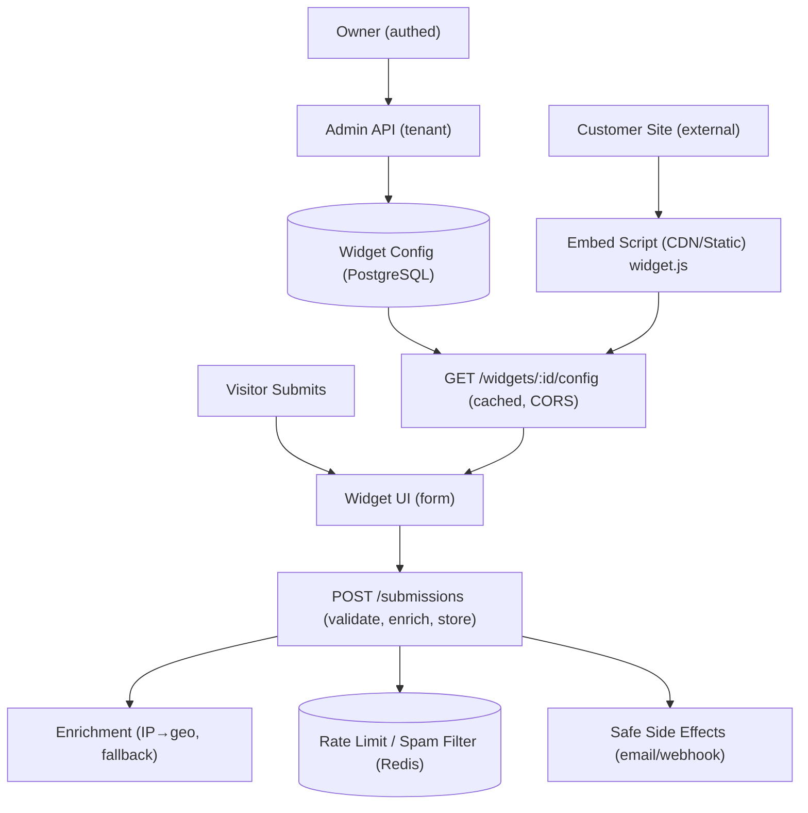

# FlyRank Internship Program

A structured backend engineering internship program that builds progressively toward a production-grade capstone project. Each weekly module introduces a foundational concept — starting from simple in-memory REST APIs and advancing through databases, authentication, and scraping — culminating in the **Embeddable Widget & Lead-Capture Platform**.

---

## 📁 Repository Structure

```
FlyRank-Internship-Program/
├── week-two/           # In-memory REST API (Node.js + Express + Swagger)
├── week-three/         # PostgreSQL + Docker integration
├── week-four/          # SQLite persistence layer
├── week-five/          # JWT authentication (Next.js + Supabase)
├── week-six/           # Python web scraping pipeline
└── capstone-project/   # Embeddable Widget & Lead-Capture Platform ⭐
```

---

## 🗓️ Weekly Modules

### [Week Two — In-Memory Task API](./week-two/)

A lightweight REST API built with **Node.js + Express** that performs full CRUD on an in-memory task store. Interactive docs are auto-served via **Swagger UI**.

- **Stack:** Node.js, Express, OpenAPI 3.0, Swagger UI
- **Key concepts:** REST conventions, HTTP status codes, input validation, API documentation
- **Endpoints:** `GET /tasks`, `POST /tasks`, `GET /tasks/:id`, `PUT /tasks/:id`, `DELETE /tasks/:id`

---

### [Week Three — PostgreSQL & Docker Integration](./week-three/)

Upgrades the Week Two app from an in-memory array to a real **PostgreSQL** database running in **Docker**. The swap required changing only a single `require` statement — proving clean storage abstraction.

- **Stack:** Node.js, Express, PostgreSQL, Docker Compose
- **Key concepts:** Repository pattern, data persistence, Docker volumes, container orchestration
- **Highlight:** Data survives full container restarts via a named Docker volume (`pgdata`)

---

### [Week Four — SQLite Persistence](./week-four/)

Replaces the in-memory store with **SQLite** — a serverless, zero-config relational database that stores everything in a single file (`tasks.db`).

- **Stack:** Node.js, Express, SQLite (`better-sqlite3`), Swagger UI
- **Key concepts:** File-based databases, automatic schema creation, SQL queries in route handlers
- **Highlight:** Database file is auto-created on first run with 3 seed tasks

---

### [Week Five — Secure Auth API](./week-five/)

A secure backend built with **Next.js** that implements user authentication and route protection using **JSON Web Tokens (JWTs)** and **Supabase** as the Identity Provider.

- **Stack:** Next.js, Supabase, JWT, Express (Swagger bridge), TypeScript
- **Key concepts:** Authentication flows, Bearer token validation, middleware-based route guards, IdP integration
- **Endpoints:** `/auth/signup`, `/auth/login`, `/auth/logout`, `/public/info`, `/protected/profile`, `/protected/dashboard`

---

### [Week Six — Web Scraping Pipeline](./week-six/)

A professional **Python** scraping pipeline that crawls [books.toscrape.com](https://books.toscrape.com) through a five-stage pipeline and outputs a clean, typed dataset of ~1,000 books.

- **Stack:** Python, `requests`, `BeautifulSoup`, `lxml`
- **Pipeline stages:** `fetch → parse → extract → clean → structure → save`
- **Output:** `data/books.json` and `data/books.csv`
- **Ethical scraping:** `robots.txt` enforcement, custom `User-Agent`, configurable rate-limiting delay

---

## ⭐ Capstone Project — Embeddable Widget & Lead-Capture Platform

> The primary deliverable of this internship program. A full-stack, production-grade backend system that synthesizes all concepts learned across the weekly modules.

### What It Is

The **Embeddable Widget & Lead-Capture Platform** lets customers (Widget Owners) define embeddable widgets (popovers, signup forms, CTAs), generate a one-line `<script>` snippet, deploy it on any external website, and have visitor form submissions captured, enriched, and stored — all with robust abuse protection.

### What Problem It Solves

Embedding widgets on third-party domains introduces serious security, performance, and reliability challenges. This platform addresses them through:

| Challenge | Solution |
|-----------|----------|
| Cross-origin abuse | Strict CORS policies, explicit allowlists per widget |
| Bot & spam submissions | Honeypot fields + heuristic spam filter |
| Rate abuse | Redis token-bucket rate limiting (per IP + per widget) |
| Geo enrichment failures | 3-provider fallback chain (`ipwho.is` → `ipapi.co` → `freeipapi.com`) |
| Slow 3rd-party side effects | Fire-and-forget async queue (email/webhook never blocks response) |
| Config delivery latency | ETag/Cache-Control headers + Redis-cached widget configs |

---

### Architecture

The system has a clear separation between two API surfaces:



---

### Tech Stack

| Layer | Technology |
|-------|------------|
| **Runtime** | Node.js v20+ |
| **API Framework** | Express |
| **Database** | PostgreSQL via [Neon](https://neon.tech) (Prisma ORM) |
| **Cache & Rate Limiting** | Redis via [Upstash](https://upstash.com) (`@upstash/redis`) |
| **Auth** | JWT (`jsonwebtoken`) + `bcryptjs` |
| **Validation** | Zod schemas |
| **Logging** | `pino` + `pino-pretty` |
| **Testing** | Vitest + Supertest |
| **Frontend Dashboard** | React.js (Vite) |
| **Containerization** | Docker + Docker Compose |

---

### API Reference

#### Admin API (Authenticated, Tenant-Scoped)

| Method | Path | Description |
|--------|------|-------------|
| `POST` | `/api/auth/register` | Register a new tenant |
| `POST` | `/api/auth/login` | Login, receive JWT |
| `POST` | `/api/widgets` | Create a widget |
| `GET` | `/api/widgets` | List all widgets (paginated) |
| `GET` | `/api/widgets/:id` | Get widget details |
| `PATCH` | `/api/widgets/:id` | Update widget (bumps version) |
| `DELETE` | `/api/widgets/:id` | Soft-delete a widget |
| `POST` | `/api/widgets/:id/snippet` | Generate embed snippet |
| `GET` | `/api/dashboard/stats` | Aggregate submission stats |
| `GET` | `/api/dashboard/submissions` | Paginated submissions list |
| `GET` | `/api/dashboard/submissions/:id` | Submission detail |

#### Public API (Unauthenticated, CORS-Enabled)

| Method | Path | Description |
|--------|------|-------------|
| `GET` | `/widgets/:id/config` | Widget config (cached, versioned) |
| `POST` | `/submissions` | Submit form data |
| `OPTIONS` | `/submissions` | CORS preflight |

---

### Database Schema

```
TENANT ──< WIDGET ──< SUBMISSION
  │                        │
  └────────────────────────┘
```

- **Tenant** — widget owner account with `apiKey`, `email`, `passwordHash`
- **Widget** — configurable widget with `type` (`POPOVER`, `SIGNUP_FORM`, `CTA`), `config` JSON, and a `version` for cache-busting
- **Submission** — captured form data with `enriched` geo-data, hashed IP, and processing `status` (`PENDING` → `ENRICHED` → `STORED`)

---

### Project Structure

```
capstone-project/
├── src/
│   ├── index.js              # Entry point
│   ├── app.js                # Express app setup
│   ├── routes/
│   │   ├── admin/            # Admin API routes (widgets, dashboard, auth)
│   │   └── public/           # Public API routes (config, submissions)
│   ├── services/             # Business logic (widget, submission, enrichment)
│   ├── repositories/         # Database access (Prisma)
│   ├── middleware/            # Auth, CORS, tenant isolation
│   ├── validation/            # Zod schemas for all inputs
│   ├── lib/                   # Rate limiter, spam filter, side-effects queue
│   └── utils/                 # Logger, error handling helpers
├── prisma/
│   └── schema.prisma          # Database schema
├── public/
│   ├── widget.js              # Compiled embed script (vanilla JS, Shadow DOM)
│   └── dashboard.html         # Owner dashboard UI
├── dashboard/                 # React dashboard frontend (Vite)
├── demo/
│   └── customer-site.html     # Demo integration page (external origin)
├── tests/                     # Unit, integration, and E2E tests
├── scripts/
│   └── build.js               # Embed script build pipeline
├── Dockerfile
├── docker-compose.yml
├── .env.example               # Environment variable template
├── PLAN.md                    # Full implementation plan (9-week roadmap)
├── ARCHITECTURE.md            # Detailed architecture diagrams & data flows
├── API.md                     # Complete API reference
├── SECURITY.md                # Threat model & mitigations
└── README.md                  # Capstone-specific setup guide
```

---

### Setup & Running Locally

#### Prerequisites

- Node.js v20+
- A [Neon](https://neon.tech) account (free-tier cloud PostgreSQL)
- An [Upstash](https://upstash.com) account (free-tier serverless Redis)
- Docker & Docker Compose *(optional, for containerised deployment)*

#### Quick Start

```bash
# 1. Navigate to the capstone project
cd capstone-project

# 2. Install dependencies
npm install

# 3. Set up environment variables
cp .env.example .env
# Fill in DATABASE_URL, UPSTASH_REDIS_REST_URL, UPSTASH_REDIS_REST_TOKEN, JWT_SECRET

# 4. Push the Prisma schema to Neon
npm run db:push

# 5. Start the development server
npm run dev
```

#### Available Scripts

| Command | Description |
|---------|-------------|
| `npm run dev` | Start server in watch mode |
| `npm start` | Start in production mode |
| `npm test` | Run all tests (Vitest) |
| `npm run test:watch` | Run tests in watch mode |
| `npm run test:coverage` | Run tests with coverage report |
| `npm run lint` | Lint `src/` and `tests/` |
| `npm run lint:fix` | Auto-fix lint issues |
| `npm run format` | Format code with Prettier |
| `npm run db:push` | Push Prisma schema to database |
| `npm run db:migrate` | Run Prisma migrations |
| `npm run db:studio` | Open Prisma Studio (DB browser) |
| `npm run build` | Build the embed script (`public/widget.js`) |

#### Docker Deployment

```bash
cd capstone-project
docker compose up -d
```

---

### Security Model

| Threat | Mitigation |
|--------|------------|
| XSS in widget | Shadow DOM isolation, CSP headers, sanitized inputs |
| CSRF | Stateless JWT in `Authorization` header (no cookies) |
| CORS misconfiguration | Explicit per-widget origin allowlist, no wildcard + credentials |
| SQL injection | Prisma parameterized queries + Zod boundary validation |
| DDoS / Abuse | Redis rate limiting (IP + widget), 100KB request size limit |
| Data leakage | Tenant isolation enforced at middleware + DB query level |
| Secrets exposure | Env vars only; Docker secrets in production |

---

### Testing Strategy

| Level | Tooling | Target |
|-------|---------|--------|
| **Unit** | Vitest | 80%+ — services, utils, validation |
| **Integration** | Vitest + Supertest | All API routes |
| **E2E** | Playwright (headless) | embed → submit → dashboard |

Key test cases: CORS preflight, payload validation, rate limiter (429 at threshold), honeypot spam filter, enrichment fallback, side-effect failure isolation, tenant isolation, cache headers.

---

### Capstone Milestones

| Milestone | Week | Focus |
|-----------|------|-------|
| M1 — Foundation | 3 | Repo setup, Docker, Prisma schema, auth middleware, health check |
| M2 — Admin API | 5 | Widget CRUD, snippet generation, tenant isolation, validation |
| M3 — Public API | 6 | CORS, submission endpoint, rate limiting, spam filter, enrichment |
| M4 — Embed & Config | 8 | Config delivery, `widget.js` embed script, demo site |
| M5 — Dashboard & Polish | 8–9 | Dashboard UI, SSE updates, full docs, final test run |

---

## 🛠️ Common Prerequisites (All Weeks)

- **Node.js** v18+ (v20+ for the capstone)
- **npm** v8+
- **Docker & Docker Compose** (weeks three, capstone)
- **Python 3.9+** (week six only)
- **Git**

---

## 📄 Additional Documentation (Capstone)

- [ARCHITECTURE.md](./capstone-project/ARCHITECTURE.md) — Detailed architecture diagrams and sequence flows
- [API.md](./capstone-project/API.md) — Complete API specification
- [SECURITY.md](./capstone-project/SECURITY.md) — Threat model and security controls

---

*FlyRank Internship Program — Backend AI Engineering Track*
