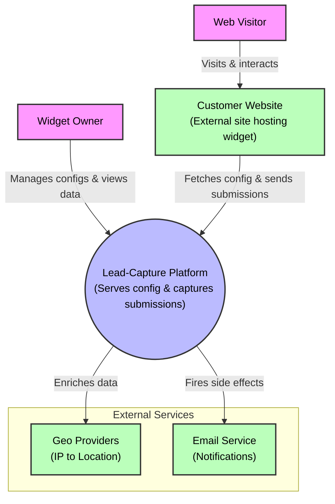
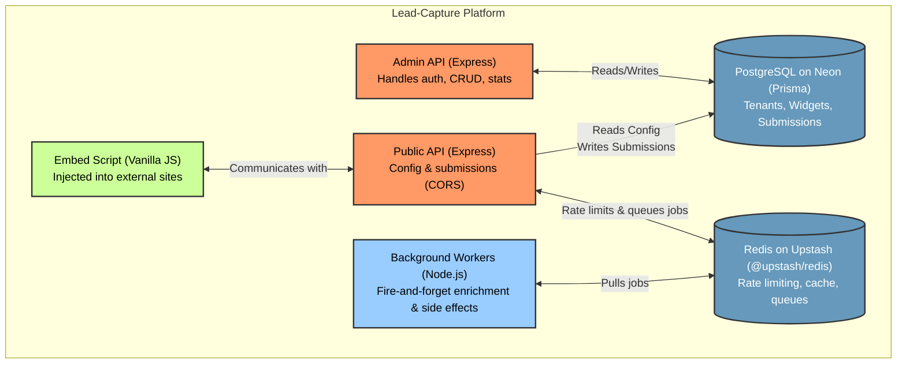
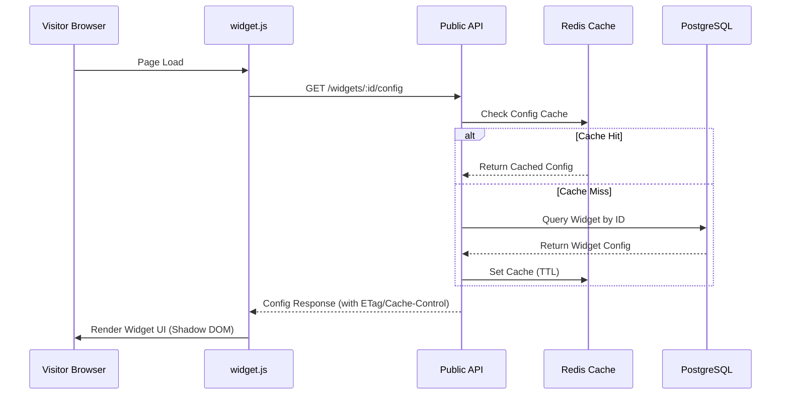
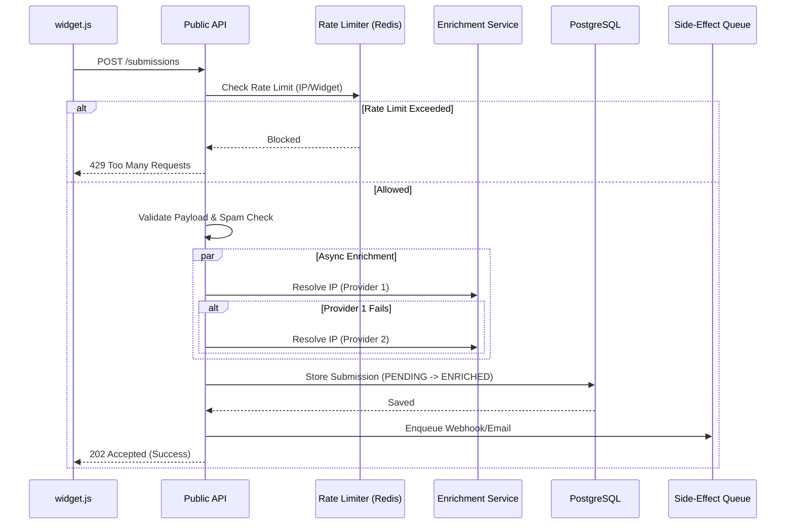
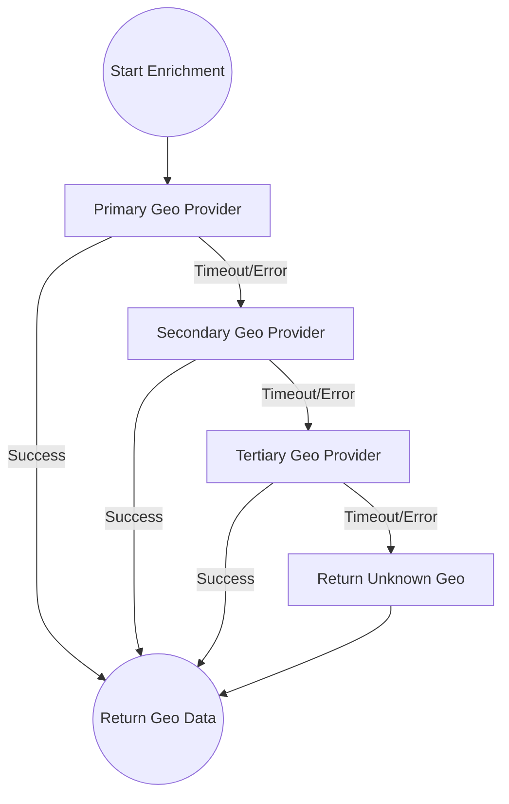
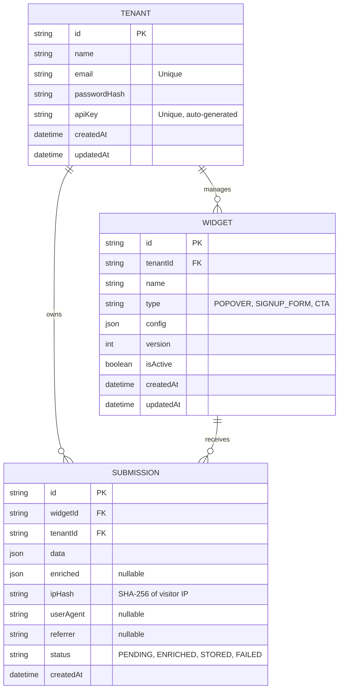

# Architecture Documentation

This document provides a detailed overview of the system architecture, components, and data flows for the Embeddable Widget & Lead-Capture Platform.

## 1. System Overview

The system is designed to provide isolated tenant configuration while exposing a highly resilient, public-facing endpoint for capturing data from external web properties. 

## 2. Component Architecture

The backend is built with Express (Node.js) and splits into two logical boundaries: the **Admin API** and the **Public API**.

## 3. Data Flows

### 3.1 Embed Script Initialization

When a visitor loads a page on the customer's site, the embed script fetches the widget configuration.

### 3.2 Submission Processing

When a form is submitted, the payload undergoes rigorous validation and asynchronous processing.

### 3.3 Data Enrichment Fallback

To ensure resilience, the IP-to-geo enrichment uses a fallback chain. If the primary provider fails, it seamlessly degrades to secondary options without blocking the main thread.

## 4. Database Schema

The core relational model ensures tenant data isolation.

## 5. Security & Isolation

- **Tenant Isolation:** All Admin API routes and database queries enforce `tenantId` boundaries.
- **DDoS/Abuse Protection:** Redis token-bucket rate limiting based on IP and Widget combination.
- **Spam Control:** Hidden honeypot fields on the frontend; if filled, submissions are silently discarded.
- **XSS Protection:** The embed script renders inside a Shadow DOM to isolate styles and prevent script injection collisions on the host site.
