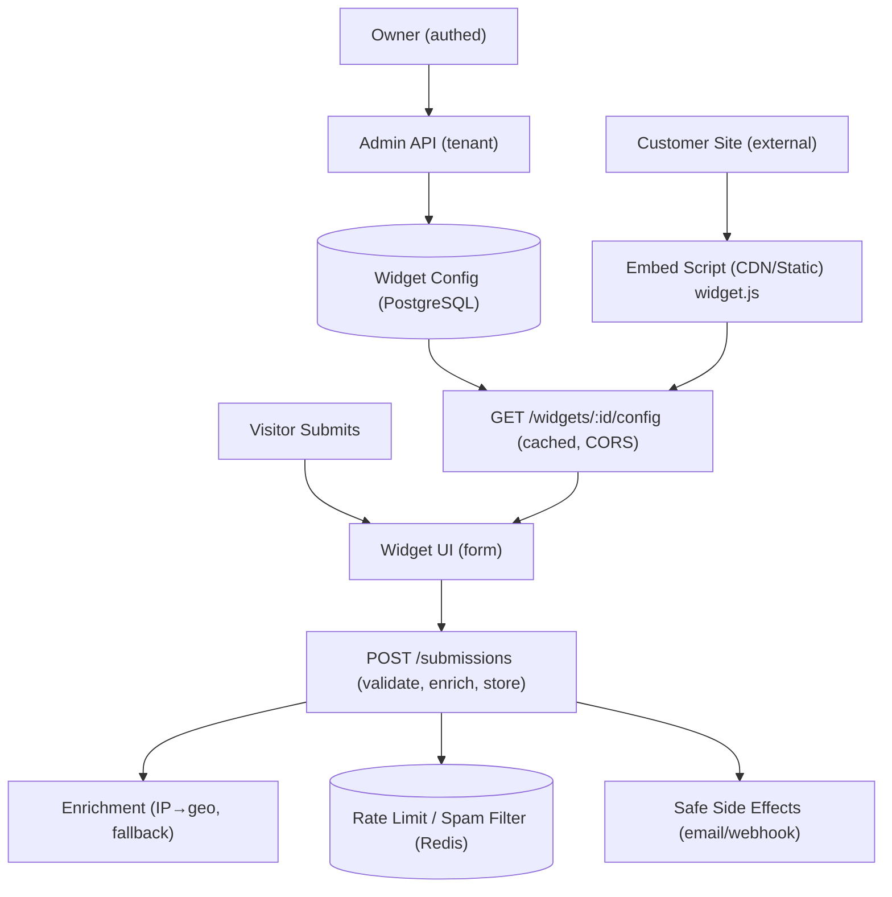

# Embeddable Widget & Lead-Capture Platform

## What It Is
This is the **Embeddable Widget & Lead-Capture Platform**, a backend engineering capstone project. It provides a full-stack solution for creating, managing, and serving embeddable widgets (like popovers, signup forms, and CTAs) across external websites. 

## What It Does
The platform allows customers (Widget Owners) to:
- Define and customize embeddable widgets through an admin dashboard.
- Generate a simple, one-line `<script>` snippet.
- Deploy the widget on any external website regardless of origin.

When a visitor interacts with the widget on an external site, the platform:
- Delivers the widget configuration quickly via CDN-grade public endpoints.
- Securely captures form submissions.
- Processes submissions through robust spam filters and rate limiters.
- Enriches the captured lead data (e.g., resolving IP addresses to geo-location).
- Safely triggers side effects like email confirmations and webhooks without blocking the submission flow.

## What Problem It Works On
Embedding widgets on third-party domains introduces significant security, performance, and reliability challenges. This platform addresses these problems by providing:
- **Zero-trust public endpoints:** Hardened against abuse with strict CORS policies, payload validation, and rate limiting.
- **Abuse Resistance:** Built-in spam controls (honeypots, heuristics) to protect against bots.
- **Resilient Enrichment:** A robust fallback chain for data enrichment (e.g., IP→geo) that survives upstream failures.
- **Graceful Degradation:** Asynchronous side effects (like sending emails or triggering webhooks) ensure that primary submissions never fail even if third-party services go down.
- **CDN-Grade Config Delivery:** Fast, cached, cross-origin asset serving to ensure the widget doesn't slow down the host site.

## Setup

### Prerequisites
- Node.js (v20.0.0 or higher)
- Docker & Docker Compose (for local database and Redis)

### Installation Steps

1. **Clone the repository and install dependencies:**
   ```bash
   npm install
   ```

2. **Environment Variables:**
   Copy the example environment file and configure it as needed.
   ```bash
   cp .env.example .env
   ```

3. **Start Local Infrastructure:**
   Use Docker Compose to start PostgreSQL and Redis locally.
   ```bash
   docker-compose up -d
   ```

4. **Database Setup:**
   Push the Prisma schema to the database to set up tables.
   ```bash
   npm run db:push
   ```

5. **Start the Development Server:**
   Run the backend in watch mode.
   ```bash
   npm run dev
   ```

### Other Useful Commands
- `npm run test` - Run tests
- `npm run lint` - Run ESLint
- `npm run format` - Format code using Prettier
- `npm run db:studio` - Open Prisma Studio to inspect the database

## Architecture Overview

The system is designed with a clear separation between the authenticated Admin API (for widget owners) and the highly hardened Public API (for external widgets).



### Core Stack
- **API Framework:** Express (Node.js)
- **Database:** PostgreSQL accessed via Prisma ORM
- **Cache & Rate Limiting:** Redis
- **Auth:** JWT + bcrypt (tenant-scoped)
- **Testing:** Vitest & Supertest
