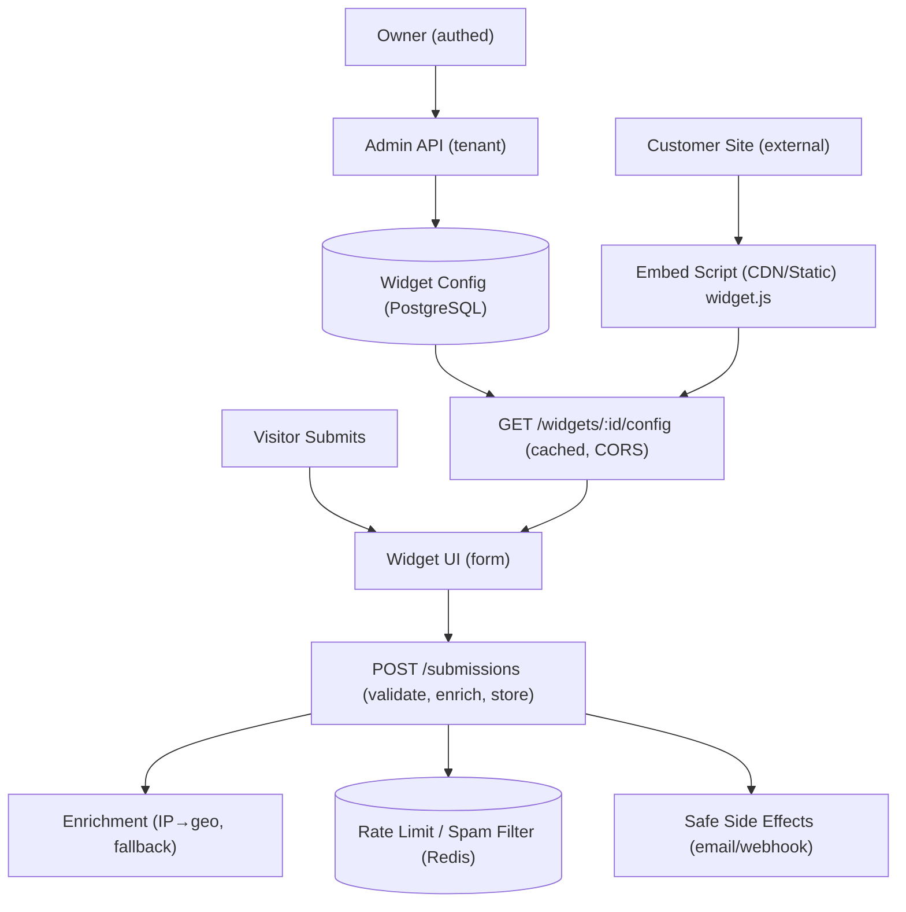

# Embeddable Widget & Lead-Capture Platform

## What It Is
This is the **Embeddable Widget & Lead-Capture Platform**, a backend engineering capstone project. It provides a full-stack solution for creating, managing, and serving embeddable widgets (like popovers, signup forms, and CTAs) across external websites. 

## What It Does
The platform allows customers (Widget Owners) to:
- Define and customize embeddable widgets through an admin dashboard.
- Generate a simple, one-line `<script>` snippet.
- Deploy the widget on any external website regardless of origin.

When a visitor interacts with the widget on an external site, the platform:
- Delivers the widget configuration quickly via CDN-grade public endpoints.
- Securely captures form submissions.
- Processes submissions through robust spam filters and rate limiters.
- Enriches the captured lead data (e.g., resolving IP addresses to geo-location).
- Safely triggers side effects like email confirmations and webhooks without blocking the submission flow.

## What Problem It Works On
Embedding widgets on third-party domains introduces significant security, performance, and reliability challenges. This platform addresses these problems by providing:
- **Zero-trust public endpoints:** Hardened against abuse with strict CORS policies, payload validation, and rate limiting.
- **Abuse Resistance:** Built-in spam controls (honeypots, heuristics) to protect against bots.
- **Resilient Enrichment:** A robust fallback chain for data enrichment (e.g., IP→geo) using fully free, HTTPS-only external providers (`ipwho.is`, `ipapi.co`, `freeipapi.com`), which survives upstream failures. It also includes local network/private IP short-circuiting.
- **Graceful Degradation:** Asynchronous side effects (like sending emails or triggering webhooks) ensure that primary submissions never fail even if third-party services go down.
- **CDN-Grade Config Delivery:** Fast, cached, cross-origin asset serving to ensure the widget doesn't slow down the host site.

## Setup

### Prerequisites
- Node.js (v20.0.0 or higher)
- A [Neon](https://neon.tech) account (cloud PostgreSQL) — no local Postgres needed
- An [Upstash](https://upstash.com) account (serverless Redis) — no local Redis needed
- Docker & Docker Compose (optional, for containerised deployment only)

### Installation Steps

1. **Clone the repository and install dependencies:**
   ```bash
   npm install
   ```

2. **Environment Variables:**
   Copy the example environment file and fill in your Neon and Upstash credentials.
   ```bash
   cp .env.example .env
   ```
   Key variables to set:
   - `DATABASE_URL` — Neon pooled connection string
   - `UPSTASH_REDIS_REST_URL` — Upstash REST endpoint
   - `UPSTASH_REDIS_REST_TOKEN` — Upstash REST token
   - `JWT_SECRET` — at least 64 random characters

3. **Database Setup:**
   Push the Prisma schema to your Neon database to create tables.
   ```bash
   npm run db:push
   ```

4. **Start the Development Server:**
   Run the backend in watch mode (uses Node.js built-in `--watch`).
   ```bash
   npm run dev
   ```

### Setup with Docker

Docker is the fastest way to get the full stack (backend API + React dashboard) running locally without manually installing Node.js or configuring a build toolchain.

> **Note:** The platform uses managed cloud services for the database and cache. You still need a [Neon](https://neon.tech) PostgreSQL connection string and an [Upstash](https://upstash.com) Redis REST URL — no local Postgres or Redis containers are required.

#### Prerequisites
- [Docker Desktop](https://www.docker.com/products/docker-desktop/) (v24+ recommended) with Docker Compose v2 included.

#### Option A — Docker Compose (Recommended)

This starts both the **Express backend** (`app`, port `3000`) and the **React dashboard** served by Nginx (`dashboard`, port `80`) in a single command.

1. **Copy and fill in environment variables:**
   ```bash
   cp .env.example .env
   # Edit .env and set DATABASE_URL, UPSTASH_REDIS_REST_URL,
   # UPSTASH_REDIS_REST_TOKEN, and JWT_SECRET
   ```

2. **Build images and start all services:**
   ```bash
   docker compose up --build
   ```
   - Backend API: `http://localhost:3000`
   - Dashboard UI: `http://localhost:80`

3. **Push the Prisma schema to your Neon database** (first run only):
   ```bash
   docker compose exec app npx prisma db push
   ```

4. **Stop all services:**
   ```bash
   docker compose down
   ```

#### Option B — Standalone Dockerfile (Backend Only)

Use this if you only need the Express API without the React dashboard.

1. **Build the image:**
   ```bash
   docker build -t widget-platform .
   ```

2. **Run the container** (pass your `.env` file):
   ```bash
   docker run --rm -p 3000:3000 --env-file .env widget-platform
   ```
   The API will be available at `http://localhost:3000`.

#### Useful Docker Commands

| Command | Description |
|---|---|
| `docker compose up --build -d` | Start all services in detached (background) mode |
| `docker compose logs -f` | Follow live logs from all services |
| `docker compose logs -f app` | Follow logs from the backend only |
| `docker compose down -v` | Stop services and remove volumes |
| `docker compose exec app sh` | Open a shell inside the running backend container |
| `docker compose ps` | Check running service status and health |

#### Docker Architecture

The `docker-compose.yml` defines two services:

| Service | Dockerfile | Port | Description |
|---|---|---|---|
| `app` | `./Dockerfile` | `3000` | Express API (Node 20 Alpine). Installs all deps → generates Prisma client → prunes devDeps |
| `dashboard` | `./dashboard/Dockerfile` | `80` | React SPA (multi-stage: Vite build → Nginx 1.27 Alpine). Proxies `/api/*` → `app:3000` |

The `dashboard` service waits for `app` to pass its health check (`GET /health`) before starting.

---

### Other Useful Commands
- `npm run test` - Run tests (Vitest)
- `npm run test:watch` - Run tests in watch mode
- `npm run test:coverage` - Run tests with coverage report
- `npm run lint` - Run ESLint on `src/` and `tests/`
- `npm run lint:fix` - Auto-fix lint issues
- `npm run format` - Format code using Prettier
- `npm run format:check` - Check formatting without writing
- `npm run db:push` - Push Prisma schema to the database
- `npm run db:migrate` - Run Prisma migrations (dev)
- `npm run db:studio` - Open Prisma Studio to inspect the database
- `npm run build` - Build the embed script (`public/widget.js`)
- `npm start` - Start the server in production mode

## Architecture Overview

The system is designed with a clear separation between the authenticated Admin API (for widget owners) and the highly hardened Public API (for external widgets).



### Core Stack
- **API Framework:** Express (Node.js, v20+)
- **Database:** PostgreSQL via [Neon](https://neon.tech) — accessed with Prisma ORM (`@prisma/client` + `@prisma/adapter-neon`)
- **Cache & Rate Limiting:** Redis via [Upstash](https://upstash.com) (`@upstash/redis`, HTTP-based, serverless-compatible)
- **Auth:** JWT (`jsonwebtoken`) + `bcryptjs` (tenant-scoped)
- **Logging:** `pino` + `pino-pretty`
- **Validation:** Zod schemas
- **Testing:** Vitest & Supertest
- **Frontend:** React.js (Vite framework)
