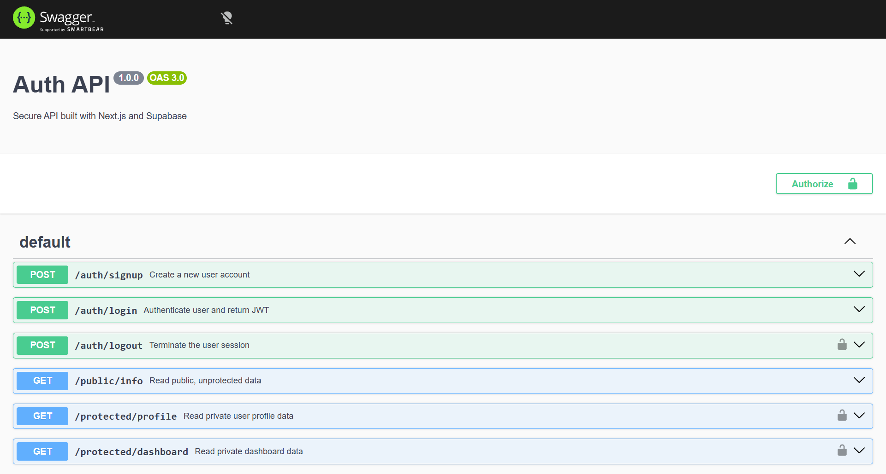

# Secure Auth API

## Overview

This project is a secure backend API built to handle user authentication and protect specific routes using JSON Web Tokens (JWTs). It leverages **Next.js** for the API endpoints and **Supabase** as the Identity Provider (IdP) for secure account management, token issuance, and token verification.

The application automatically guards protected routes using Next.js middleware, rejecting any requests that lack a valid Bearer token. It also includes an interactive API documentation interface powered by **Swagger UI** and **Express**.

## Setup & Local Development

### 1. Environment Variables

Create a `.env` file in the root of your project directory. This file should never be committed to Git (ensure it is in your `.gitignore`).

Add your Supabase project URL and anon key to the `.env` file:

```env
SUPABASE_URL=your_project_url
SUPABASE_KEY=your_anon_key
PORT=3000
```

### 2. Install Dependencies

Ensure you have Node.js installed, then run:

```bash
npm install
```

### 3. Run the Server

Start the development server using the custom Express script (which automatically serves the Swagger UI and Next.js routes):

```bash
npm run dev
```

The server will log `Server running and connected to Supabase` and start listening on port 3000.

---

## API Reference

| Method | Endpoint | Purpose | Authentication |
|---|---|---|---|
| POST | `/auth/signup` | Create a new user account | None |
| POST | `/auth/login` | Authenticate user and return JWT | None |
| POST | `/auth/logout` | Terminate the user session | `Authorization: Bearer <token>` |
| GET | `/public/info` | Read public, unprotected data | None |
| GET | `/protected/profile` | Read private user profile data | `Authorization: Bearer <token>` |
| GET | `/protected/dashboard` | Read private dashboard data | `Authorization: Bearer <token>` |

---

## Interactive Documentation (Swagger UI)

You can view and test the API directly from your browser. With the server running, navigate to:

**[http://localhost:3000/docs](http://localhost:3000/docs)**

From there, you can click the **Authorize** lock button to supply your JWT and instantly test the protected endpoints.


