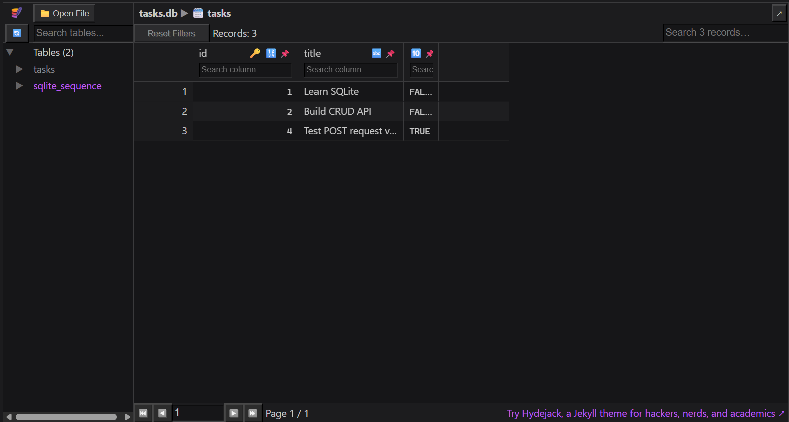

# Task API with SQLite

A lightweight REST API built with **Node.js + Express** that lets you create, read, update, and delete tasks. Instead of storing data in memory, this version persists data using **SQLite**, meaning your tasks will survive a server restart!

Interactive API docs are served automatically via **Swagger UI**.

---

## 💾 Database Details

### Why SQLite was chosen?
SQLite is a lightweight, serverless relational database engine. It was chosen because it requires zero configuration, no background database server to run, and stores the entire database in a single file on disk, making it incredibly easy to set up and use for a project like this.

### Where is the database file stored?
The database is stored in a single file named `tasks.db` located at the root of the project folder (`week-four/tasks.db`). It is automatically created the very first time you start the application.

### Database Screenshot
Here is a view of our `tasks` table populated with some example tasks:



### Example SQL Query
During testing, this query was used to insert a new task directly into the database:
```sql
INSERT INTO tasks (title, done) VALUES ('Learn SQLite', 0);
```

---

## 🚀 Install & Run

```bash
# 1. Install dependencies
npm install

# 2. Start the server (auto-restarts on file changes)
npm run dev
```

The very first time the server starts, it will automatically:
- Create the `tasks.db` file.
- Create the `tasks` table.
- Insert 3 example tasks if the table is completely empty.

Server starts at **http://localhost:3000**  
Swagger UI at **http://localhost:3000/docs**

---

## 📡 Endpoints

| Method   | Path           | Description                          | Success | Error(s)   |
|----------|----------------|--------------------------------------|---------|------------|
| `GET`    | `/tasks`       | Return all tasks                     | `200`   | `500`      |
| `POST`   | `/tasks`       | Create a task `{ "title": "..." }`   | `201`   | `400` `500`|
| `GET`    | `/tasks/:id`   | Return one task by ID                | `200`   | `404` `500`|
| `PUT`    | `/tasks/:id`   | Update `title` and/or `done`         | `200`   | `400` `404`|
| `DELETE` | `/tasks/:id`   | Delete a task                        | `204`   | `404` `500`|

### Validation rules
- **POST** — `title` must be a non-empty string; missing or blank → `400`
- **PUT** — body must contain at least one of `title` (string) or `done` (boolean); empty `{}` → `400`
- **Unknown ID** on GET / PUT / DELETE → `404 { "error": "Task <id> not found" }`

---

## 📖 Swagger UI

Interactive docs at [`/docs`](http://localhost:3000/docs) — try every endpoint directly in the browser.


---

## 📁 Project Structure

```
week-four/
├── src/
│   ├── server.js        # Entry point — binds the port
│   ├── app.js           # Express app: middleware, routes, Swagger
│   ├── db.js            # SQLite database initialization
│   └── routes/
│       └── tasks.js     # All 5 task route handlers executing SQL
├── tasks.db             # Auto-generated SQLite database file
├── openapi.json         # OpenAPI 3.0 spec
├── package.json
└── .gitignore
```
