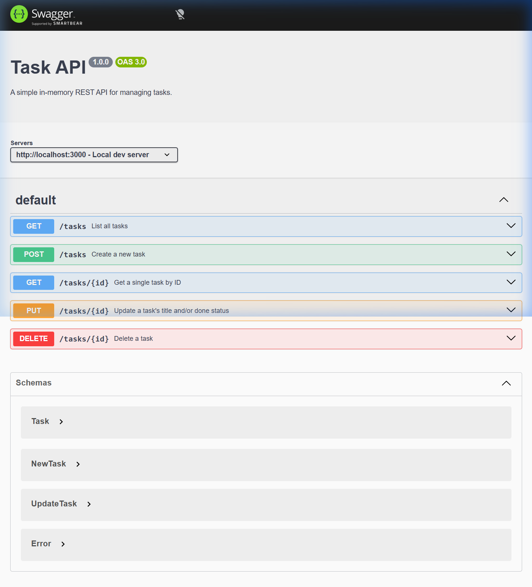

# Task API

A lightweight REST API built with **Node.js + Express** that lets you create, read, update, and delete tasks. Data lives in memory (no database needed). Interactive API docs are served automatically via **Swagger UI**.

---

## Install & Run

```bash
# 1. Install dependencies
npm install

# 2. Start the server (auto-restarts on file changes)
npm run dev
```

Server starts at **http://localhost:3000**  
Swagger UI at **http://localhost:3000/docs**

---

## Endpoints

| Method   | Path           | Description                          | Success | Error(s)   |
|----------|----------------|--------------------------------------|---------|------------|
| `GET`    | `/tasks`       | Return all tasks                     | `200`   | —          |
| `POST`   | `/tasks`       | Create a task `{ "title": "..." }`   | `201`   | `400`      |
| `GET`    | `/tasks/:id`   | Return one task by ID                | `200`   | `404`      |
| `PUT`    | `/tasks/:id`   | Update `title` and/or `done`         | `200`   | `400` `404`|
| `DELETE` | `/tasks/:id`   | Delete a task                        | `204`   | `404`      |

### Validation rules
- **POST** — `title` must be a non-empty string; missing or blank → `400`
- **PUT** — body must contain at least one of `title` (string) or `done` (boolean); empty `{}` → `400`
- **Unknown ID** on GET / PUT / DELETE → `404 { "error": "Task <id> not found" }`

---

## Example — Create a task

```
curl -i -X POST http://localhost:3000/tasks \
  -H "Content-Type: application/json" \
  -d '{"title":"Buy milk"}'
```

**Response:**

```
HTTP/1.1 201 Created
X-Powered-By: Express
Content-Type: application/json; charset=utf-8
Content-Length: 40
ETag: W/"28-gPXr/tBcmKMXZwSEhav9o8e9gYc"
Date: Tue, 14 Jul 2026 16:15:36 GMT
Connection: keep-alive
Keep-Alive: timeout=5

{"id":5,"title":"Buy milk","done":false}
```

---

## Swagger UI

Interactive docs at [`/docs`](http://localhost:3000/docs) — try every endpoint directly in the browser.



---

## Project Structure

```
week-two/
├── src/
│   ├── server.js        # Entry point — binds the port
│   ├── app.js           # Express app: middleware, routes, Swagger
│   ├── data/
│   │   └── tasks.js     # In-memory task store
│   └── routes/
│       └── tasks.js     # All 5 task route handlers
├── openapi.json         # OpenAPI 3.0 spec
├── package.json
└── .gitignore
```
